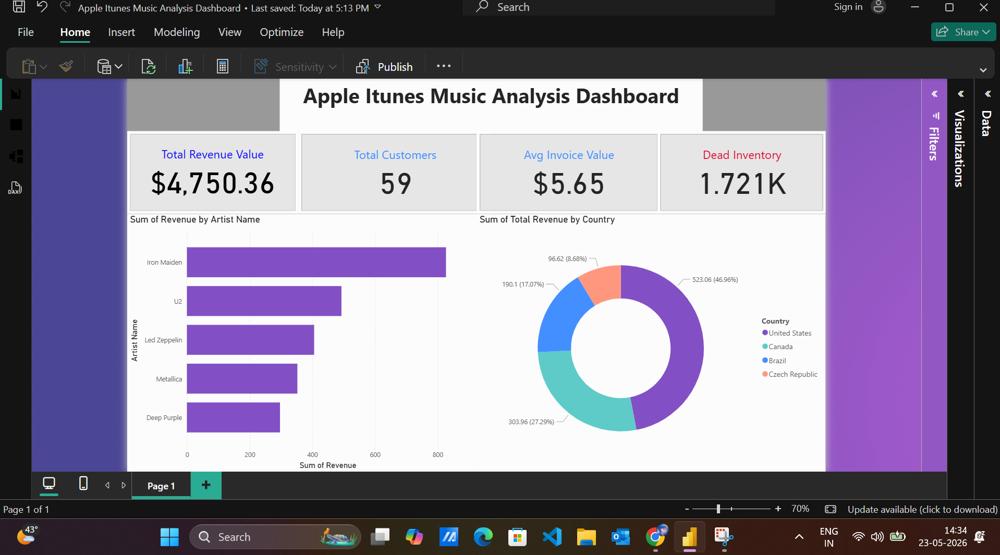

# Apple iTunes Ecosystem Analytics & Business Intelligence

An end-to-end data analytics and business intelligence project optimizing the Chinook database model to extract revenue patterns, inventory insights, and customer behavior metrics using SQL and Power BI.

## 📊 Dashboard Preview

## 🛠️ Tech Stack Used
* **Database System:** MySQL / DBeaver
* **Business Intelligence:** Power BI Desktop
* **Documentation:** Markdown / MS Word

## 🎯 Key Metrics Discovered
* **Total Catalog Revenue:** $4,750.36
* **Active Customer Base:** 59 (With 100% Retention Rate)
* **Average Invoice Value:** $5.65
* **Underutilized Inventory:** 1,721 Tracks (Never Purchased)

## 🚀 Key Insights & Strategic Recommendations
1. **Dead Inventory Monetization:** Algorithmic bundling of the 1,721 unpurchased tracks with premium assets like Iron Maiden and Led Zeppelin.
2. **AOV Optimization:** Introduce a $6.99 threshold incentive to organically increase the average invoice size from $5.65.
3. **SaaS Transition:** Launch genre-based monthly subscription passes (e.g., 'The Rock Vault') for predictable recurring revenue streams.

## 📁 Repository Structure
* `SQL_Scripts/` - Contains raw analytical queries executed in DBeaver.
* `Dashboard/` - Contains the interactive `.pbix` Power BI dashboard file.
* `Documentation/` - Comprehensive formal project report in English.
